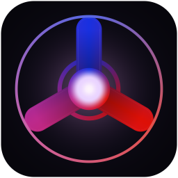
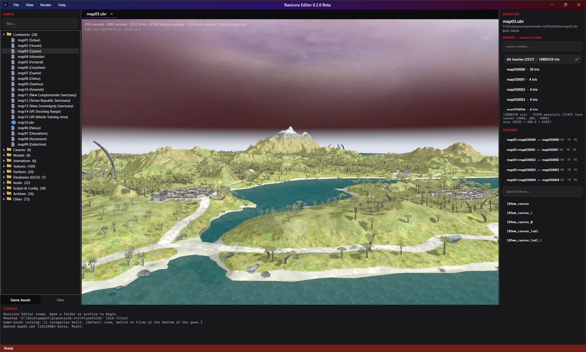

<div align="center">



# Raxicore Editor

A cross-platform desktop **viewer, editor, and unpacker** for **engine-derived** game assets,
written in **C# / .NET 10** with an offscreen-Vulkan 3D viewport.

[](LICENSE)
[](https://dotnet.microsoft.com/)
[](https://avaloniaui.net/)

</div>

---

Raxicore Editor opens the container formats the engine ships next to its client executable —
archives, meshes, animations, textures, surfaces, and the ASCII databases — and renders, inspects,
and edits them. The asset-format code is an original C# reimplementation of the container and
content formats used by an engine-derived client.

> **You need your own copy of the engine-derived game assets.** No game data is included or
> distributed with this project.




## Features

- **Asset browser** — mount a folder or open an archive; a role-grouped catalog (Continents, Models,
  Animations, Textures, Surfaces, Databases, Audio) alongside the raw on-disk tree. Archive contents
  load lazily.
- **3D viewport** — Silk.NET **Vulkan rendered fully offscreen** (no swapchain) and shown in Avalonia
  via a `WriteableBitmap`, sidestepping windowed-surface / device-loss crashes.
- **Textured models** — decodes `.ubr` UberMesh geometry and resolves each material to its DDS texture
  from the sibling `dds_*.fat` archives, with a per-material **texture picker** and one-click
  **NC / TR / VS empire swap** so vehicles aren't stuck on a single skin.
- **Animation** — plays skeletal (skinned) and rigid mesh-on-bone animations; `anims.ubr` auto-loads
  from the asset folder and clips are filtered to those that actually drive the selected model.
- **Continents** — opens a `mapNN.ubr` as a full continent: terrain tiles placed and textured, plus the
  static scene objects (bases, towers, trees, warpgates) resolved from `contents_mapNN.mpo` and the
  shared `uber.ubr` object library.
- **Format tools** — DDS/image preview, a paintable `.srf` surface-type editor, `game_objects` and
  generic ASCII-database table views, live-validated text editing, and a hex fallback.
- **Export** — write the active document's bytes, or export a mesh to Wavefront **OBJ** (+ MTL +
  textures).

## Supported formats

| Format | Extension(s) | Read | Notes |
|---|---|:---:|---|
| PACK archive | `.pak` | ✅ | v2 container, LZO1X records + length-seeded CRC |
| FLAT archive | `.fat` / `.fdx` | ✅ | flat data store + index |
| UberMesh | `.ubr` (`uber`) | ✅ | per-`CMeshSection` geometry, skeletons |
| UberAnim | `anims.ubr` (`ANIM`) | ✅ | two-stream keyframe database |
| ASCII database | `.adb` | ✅ | `chunky` / `asciidatabase`, incl. `game_objects` |
| Surface tile | `.srf` | ✅ | 128×128 surface-type grid (paintable) |
| Map manifest | `contents_mapNN.mpo` | ✅ | tile / object placement |
| DDS texture | `.dds` | ✅ | BC1/2/3 + uncompressed 32-bpp |
| LZO1X | — | ✅ | the PACK codec |

## Requirements

- The **.NET 10 SDK**
- A **Vulkan-capable GPU** (for the 3D viewport)
- Windows or Linux

## Build & run

```bash
dotnet build RaxicoreEditor.slnx -c Debug
dotnet run --project src/RaxicoreEditor.Editor
```

Then **File → Open Folder…** and point it at your engine-derived game's install directory.

## Project layout

```
raxicore-editor/
├─ RaxicoreEditor.slnx
├─ Directory.Build.props                 # net10.0, nullable, explicit usings
└─ src/
   ├─ RaxicoreEditor.EngineAssets/       # pure format I/O class library (no UI/render deps)
   │  ├─ Archives/  Compression/  Databases/
   │  ├─ Maps/  Meshes/  Surfaces/  Textures/  IO/
   └─ RaxicoreEditor.Editor/             # Avalonia app + Silk.NET offscreen renderer
      ├─ Documents/  ViewModels/  Views/  Rendering/  Controls/
```

`RaxicoreEditor.EngineAssets` is a standalone, UI-free library (PACK, FLAT, UberMesh, UberAnim, ADB,
surface, MPO, DDS, LZO1X) reusable for headless tooling. The editor references it.

## Tech

UI is [Avalonia](https://avaloniaui.net/) 12 with the [ShadUI](https://github.com/accntech/shad-ui)
theme (follows the OS light/dark setting). The 3D viewport uses [Silk.NET](https://github.com/dotnet/Silk.NET)
Vulkan bindings, rendered offscreen. All dependencies are permissively licensed (MIT / Apache-2.0 /
OFL) — see [THIRD-PARTY-NOTICES.md](THIRD-PARTY-NOTICES.md).

## Status

A functional viewer/editor: browsing, 3D rendering, texture selection, animation playback, and
continent assembly all work. Per-format **re-pack (write-back)** beyond the surface editor and OBJ
export is the in-progress edge.

## License

[MIT](LICENSE). This project is not affiliated with or endorsed by Sony Online Entertainment,
Daybreak Game Company, or Rogue Planet Games. The source game is a trademark of its respective
owner; this is a fan-made tool that ships no game content.
